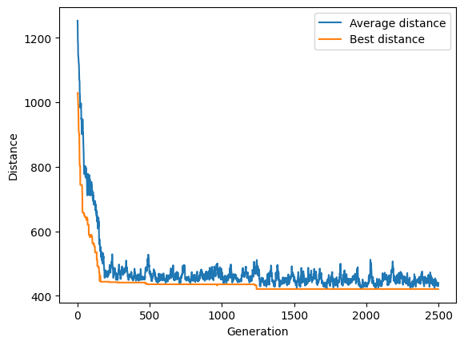
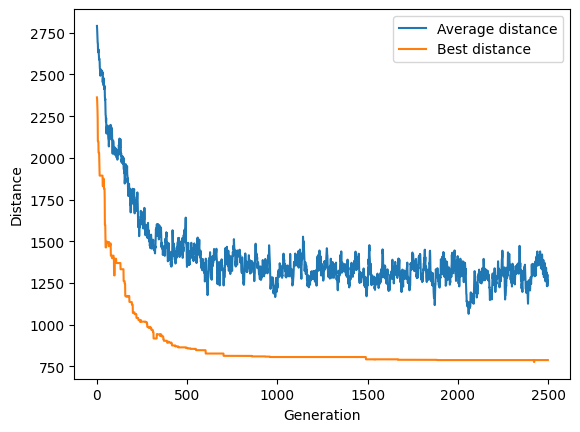

# Genetic Travelling Salesman Problem solver

This repo contains a [genetic algorithm](https://en.wikipedia.org/wiki/Genetic_algorithm) (GA) designed to solve the [Travelling Salesman Problem](https://en.wikipedia.org/wiki/Travelling_salesman_problem) (or TSP).

It works by repeatedly generating new paths from previous one in an attempt to improve them.

## Install

To install the package :

```
git clone https://github.com/charon25/GeneticTSPSolver.git
cd GeneticTSPSolver
python setup.py install --user
```

This package requires `numpy` (>= 1.21.2) and `tqdm` (>= 4.62.3).

## Usage

To use the solver, just import the package and instantiate the class :

```python
from gentsp import TSPSolver

solver = TSPSolver(distances)

solver.pass_generations(n_generations=100)
```

The solver has only one mandatory argument : a square `distances` matrix which indicates the distance between every two pair of points. Everything else is either optional or deduced.

### Optional keyword arguments

- `population_size` (int, value > 0, default: 100): size of the population of the GA.
- `mutation_rate` (float, 1.0 >= value >= 0, default: 0.05): probability of mutation of every individual
- `new_individuals` (int, value >= 0, default: 0): number of new random individuals in each generation (introduces novelty).
- `elitism` (int, value >= 0, default: 0): number of individuals to keep between every generation (only the best are kept).
- `selection` (str, 'best' or 'weighted', default: 'weighted'): method to chose the individuals which will breed:
   - `best` will use the best one (sort by increasing distance)
   - `weighted` will pick randomly with a probability proportional to the inverse of the distance
- `breeder_count` (int, value > 0, default: population_size / 2): number of individual who will breed.

Example : 

```python
solver = TSPSolver(distances, elitism=30, population_size=400, selection='best', breeder_count=30)
```

### Statistics

The function `pass_generations` return a dictionary with the following statistics (each as a list of the value for each generation) :

- `best_fitness`, `average_fitness`, `worst_fitness`
- `best_distance`, `average_distance`, `worst_distance`
- `fitness_stdev`: standard deviation of the fitnesses
- `best_individual`, `average_individual` (the closest to the average fitness), `worst_individual`

## Examples

With 25 random points (0 <= x < 100, 0 <= y < 100) and the following code :

```python
solver = TSPSolver(distances, elitism=20)
```



With 50 random points (0 <= x < 100, 0 <= y < 100) and the following code :

```python
solver = TSPSolver(distances, population_size=300, elitism=20, new_individuals=10)
```

